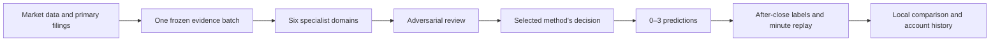

# SHAQ Daily Oracle Lab

### A local research lab for comparing AI investment methods

[简体中文](README.zh-CN.md) · [Download](#download) · [First run](#your-first-run) · [Team methods](https://github.com/Yugo616/SHAQ--Super-HKUST-AI-for-QFIN/tree/versions/shadow_versions) · [User guide](docs/user-guide.md)

**Change a method. Run it against the same evidence. See what changed.**

SHAQ brings six specialist research domains, adversarial review and a brokerless virtual account into one desktop workbench. Teams can edit research methods, run a baseline and alternative side by side, and inspect the evidence behind each prediction—without opening a trading account.

- **Comparable experiments:** method, model, data and account rules are recorded separately.
- **Visible research:** follow completed reports, counterarguments and final decisions as a run progresses.
- **Local ownership:** daily evidence, model calls, drafts, results and balances stay on your computer. GitHub shares method packages, not daily account records.

## Download

The 0.7.2 candidate is awaiting platform acceptance and publication. Its planned pages are [Windows 0.7.2](https://github.com/Yugo616/SHAQ--Super-HKUST-AI-for-QFIN/releases/tag/lab-v0.7.2-windows) and [Mac 0.7.2](https://github.com/Yugo616/SHAQ--Super-HKUST-AI-for-QFIN/releases/tag/lab-v0.7.2-macos). Until each page contains its installer, checksum and acceptance record, use the published packages below; this source change is not a release announcement.

In 0.7.2, model calls have a configurable 600-second total deadline and one transient retry by default (**Connection Settings → Advanced call settings**). **Resume original batch** fills only unfinished calls using the same frozen evidence; late recovery remains research, not on-time formal performance. Automatic research uses the native Windows/macOS scheduler. Progress refresh preserves expanded sections and selections, and isolated data collection releases its own resources. Model identity, methods, fees, balances and historical records are unchanged. See the [update guide](docs/software-updates.md).

| Your computer | Download |
|---|---|
| Windows 10/11, x64 | [Windows installer](https://github.com/Yugo616/SHAQ--Super-HKUST-AI-for-QFIN/releases/tag/lab-v0.7.1-windows) |
| Mac with Apple Silicon (M series), macOS 15+ | [Mac DMG](https://github.com/Yugo616/SHAQ--Super-HKUST-AI-for-QFIN/releases/tag/lab-v0.7.0-macos) |
| Intel Mac, macOS 15+ | [Intel DMG](https://github.com/Yugo616/SHAQ--Super-HKUST-AI-for-QFIN/releases/tag/lab-v0.7.0-macos) |

Download the **`.exe`** or **`.dmg`** only. Other assets serve the updater, checksum verification and third-party notices. Installers include Python and the simulation engine: Git, Python, Futu and a brokerage account are not end-user prerequisites. Windows requires WebView2; the installer checks it. These are internally tested prereleases without commercial signing or notarization. Check the release page before accepting an operating-system source warning.

Windows 0.7.1 uses [source commit `bc144f1`](https://github.com/Yugo616/SHAQ--Super-HKUST-AI-for-QFIN/commit/bc144f1c4135b7b009e07d009f73724f95848bb7), with a tested delta upgrade from the published Windows 0.7.0. Apple Silicon remains on 0.7.0 ([`56d6467`](https://github.com/Yugo616/SHAQ--Super-HKUST-AI-for-QFIN/commit/56d64679bb8a9291e229e29743c9be29a7a16517)); Intel remains on 0.7.0 ([`97384db`](https://github.com/Yugo616/SHAQ--Super-HKUST-AI-for-QFIN/commit/97384db94f4ccf1c85b046c4c82bc170f0c9a8d0)). Releases supply per-platform acceptance records and checksums; existing artifacts are not replaced.

## Your first run

### 1. Install and open SHAQ

On Windows, open the installer and follow its prompts. On Mac, open the DMG, install as shown, then open the installed app—not the copy inside the disk image. First-time users enter setup; returning users can reopen it from **Connection Settings (`连接设置`)**.

### 2. Choose one model connection

| Button | What you need | What SHAQ uses |
|---|---|---|
| **Connect Codex (`连接 Codex`)** | A usable Codex CLI and its authenticated account | The local CLI; no separate API key in SHAQ |
| **Connect Claude Code (`连接 Claude Code`)** | A usable Claude Code CLI and its authenticated account | The local CLI, not merely the Claude chat window |
| **Connect API (`连接 API`)** | An official API or compatible relay account | API key and model; relays also need the provider URL and context limit |

**You need only one route.** API/relay users need neither CLI. A chat subscription and an API balance are different products. WorkBuddy users can use a compatible API if their provider supplies one; SHAQ does not control WorkBuddy's desktop interface.

Finding a program is not the same as being logged in. Complete the selected CLI's browser login if requested, then retry. SHAQ saves the connection only after a real structured response passes validation. See [Codex authentication](https://learn.chatgpt.com/docs/auth), [Claude Code setup](https://code.claude.com/docs/en/setup), and [connection troubleshooting](docs/user-guide.md#1-connect-an-analysis-model).

### 3. Connect the team and check data

Click **Sign in to GitHub (`登录 GitHub`)**, confirm in the browser, and enter your team's SEC research identity: team name plus a monitored contact email. Then run the data/local-space check. GitHub login shares methods; it does not connect a model. Uploading requires repository write permission.

### 4. Run both methods and open results

On **Start Runs (`开始运行`)**, select one model and both bundled methods, then click **Run Selected Versions (`运行选中版本`)**. SHAQ collects once, freezes the evidence and runs the comparison. Expand progress to inspect finished reports. On **View Results (`查看结果`)**, click a row for full replay or select two runs to compare them.

Runs use the New York trading calendar. Weekends/holidays, times before 04:00 ET and absent current-day premarket observations are blocked with an explanation. A Monday in Asia can still be Sunday in New York. Late research stays visible but does not enter on-time premarket performance. Automatic runs require explicit activation and an awake, online computer.

## Six domains, one traceable decision

| Domain | Its question | Research foundation |
|---|---|---|
| Market context | Is this a common shock, and why might its effect persist? | Cieslak–Pang; Lou–Polk–Skouras |
| Industry and relationships | How could sector, customer, supplier or competitor information spread? | Hoberg–Phillips; Cohen–Frazzini |
| Company catalysts | What is new, relative to expectations and what is already priced? | Jiang–Li–Wang; Glasserman–Lin |
| Order flow and liquidity | Is buying/selling pressure persistent, and does price respond? | Cont–Kukanov–Stoikov |
| Options pricing and positioning | What do options imply about range, risk and reliable positioning evidence? | Pan–Poteshman; Cremers–Weinbaum |
| Price action and participation | What does the price path show beyond generic technical rules? | Murray–Xia–Xiao; Sullivan–Timmermann–White |

Each domain reports a conclusion, supporting evidence, strongest countercase, unknowns and invalidation conditions. The adversarial reviewer checks omissions, contradictions and repeated evidence. The interface displays those saved reports—not private chain-of-thought or invented retrospective reasoning. Exact sources and adopted interpretations live with the [Skills](skills/) and in [Research design](docs/research-design.md).

## Two methods, different decisions

| | Independent Evidence Gate · Formal Baseline | Cross-domain Synthesis · Shadow |
|---|---|---|
| Chinese name | 独立证据门禁版 · 正式基准 | 跨域综合研判版 · Shadow |
| Final decision | Deterministic independent-evidence and direction-agreement rules | A synthesis step weighs domain reports and the countercase |
| Disagreement | An independent opposing root prevents publication | Counterevidence must be addressed, but is not an automatic veto |
| Shared boundaries | Valid evidence, cutoff checks, traceable references, maximum three predictions | Same integrity boundaries and publication cap |

These names identify experimental roles, not proven superiority. Both are research simulations in Lab. A controlled method comparison requires matching model, data, candidates and account rules. The comparison page exposes mismatches instead of attributing every difference to the method.

## Edit, share, compare

1. **Start Runs:** select versions and a model; run now or configure automatic research; inspect today's progress.
2. **Edit Versions:** create a local draft, edit a domain's method/references/role or supported rule code, then save an immutable version. **Download** and **Upload** open multi-select team dialogs; content hashes prevent duplicate transfers.
3. **View Results:** compare predictions, correct/incorrect counts and virtual balances; open any day to inspect screening, each stock's six reports, adversarial review and final decision.

Methods come from the [`versions` branch](https://github.com/Yugo616/SHAQ--Super-HKUST-AI-for-QFIN/tree/versions/shadow_versions). Software comes from Releases. Downloading a method does not replace the app; updating the app does not rewrite method snapshots or historical predictions.

## Data and virtual accounts

Default sources are **Yahoo/yfinance**, **SEC EDGAR**, versioned index membership and **FinanceDatabase** metadata. OpenBB REST is optional, not a bundled all-inclusive free database. Order-book, reliable options trade-direction and customer-network evidence may be unavailable from free providers. Missing data is shown, never invented.

No brokerage connection is required. After the close, **Zipline** replays frozen predictions at specified minute prices, applying recorded sizing rules, fees and adverse slippage. Direction accuracy still uses regular-session open-to-close prices. Missing required minutes remain incomplete, not fictitious zero-share trades. Fills are labelled **after-close simulated replay**, not live executions. Compatible account series carry saved balances; incompatible method/model/rule identities stay separate. [Account and evaluation rules](docs/paper-evaluation.md)

## Updates

Use **Software Update (`软件更新`)** for manual checks or optional automatic updates. Downloaded updates wait for running tasks and unsaved edits before replacing the app. Version and update time are displayed; records, balances and drafts stay in the separate user-data directory.

Legacy 0.6.x users must install 0.7.0 or a later full package once. After that, a matching published delta can reduce downloads; otherwise the updater uses a verified full package. A patch release does not guarantee a small download on every platform. [Update guide](docs/software-updates.md)

## For contributors and coding assistants

Start with the [user guide](docs/user-guide.md), then follow this map. Do not treat runtime data as source or modify frozen predictions to make tests pass.

| Goal | Start here |
|---|---|
| Understand a research role | `skills/<skill>/SKILL.md`, `references/foundations.md`, `agents/openai.yaml` |
| Follow a batch | `src/shaq_daily_oracle/lab_service.py` and its research workflow calls |
| Add a model adapter | `src/shaq_daily_oracle/model_backends.py` and compatibility tests |
| Change the desktop interface | `src/shaq_daily_oracle/desktop/` and UI regression tests |
| Understand builds and updates | `packaging/README.md`, `docs/software-updates.md` |
| Validate a change | `tests/`, `scripts/validate_release.py`; native installation evidence is separate |

We draw organizational inspiration from [TradingAgents](https://github.com/TauricResearch/TradingAgents), FinCon and InvestorBench. SHAQ focuses on team method editing and same-evidence comparisons rather than adding voting personas. Research references motivate designs; they do not prove SHAQ is profitable.

Research software, not investment advice or a live-trading service. SHAQ has not added a project license; third-party components retain their own [licenses and notices](docs/third-party-notices.md).
